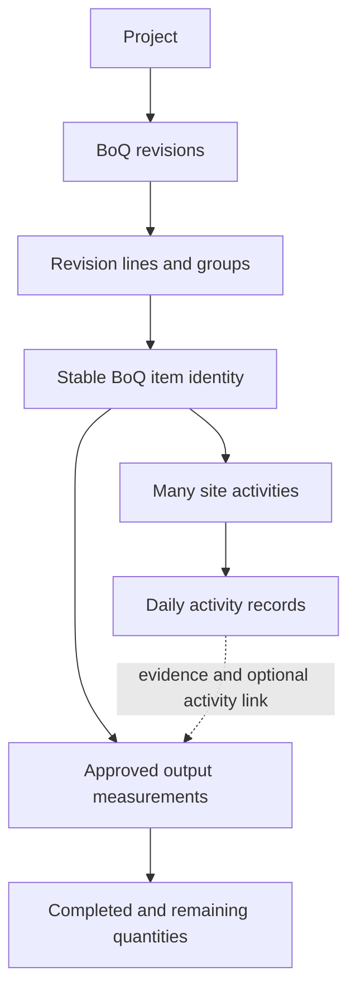

# Client upgrade implementation plan

Prepared 4 October 2026. This is a proposed implementation plan for PointERP, based on the client's Word request, both supplied Centre of Excellence workbooks, and the current source code including staged changes. It does not mark those changes as tested, deployed, or accepted by the client.

## Recommended direction

Make the BoQ the project's versioned scope and commercial schedule. Give every BoQ item a permanent identity, allow several site activities beneath it, and calculate progress from approved measurements of completed output. Preserve quantities and prices in approved revisions; show remaining work as a calculation. Keep internal resource costs, client-facing rates, physical progress, invoicing, and payments distinguishable.

Build on the existing estimate, daily site report, workforce, expense, and permission infrastructure. The staged BoQ importer and editor are useful foundations, but the workbook evidence requires changes to item matching, hierarchy, preliminaries, percentage items, and measurement rules before considering the client request complete.

Deliver the work in small, reviewable releases. Complete one representative BoQ-to-approved-progress workflow first, then expand coverage to the full workbook and the other client requests. Bank connectivity is a separate integration project with an identified bank and supported interface.

## 1. Evidence from the supplied workbooks

Sources:

- [Client upgrade request](</C:/Users/Manoah/Downloads/sky-logo/New Microsoft Word Document.docx>).
- [Unpriced BoQ](</C:/Users/Manoah/Downloads/sky-logo/Centre of Excellence BOQs - Unpriced BOQs.xlsx>).
- [Point Investment BoQ](</C:/Users/Manoah/Downloads/sky-logo/Centre of Excellence BOQs - Point Investment Company ltd.xlsx>).

Both workbooks have 42 worksheets, including three hidden sheets: `MEASUREMENT SHEETS`, `BBS SUMMARY`, and `REINFORCEMENT`. They contain eight main bills: preliminaries, building civil works, electrical installations, mechanical installations, retaining walls, external works, road works, and furniture. Building civil works splits into ground and first floors; road works splits into Series 1000 through 8000.

The inspection identified 904 candidate item rows across the 15 bill/series detail sheets other than preliminaries. The extraction criterion was a description, a unit, and a numeric quantity. This is an inspection count, not an approved import manifest: row classification still needs review, particularly percentages and allowances. All 904 lack rates in the unpriced file. In the Point Investment file, 223 have rates: 195 of 200 ground-floor candidates and 28 of 144 first-floor candidates. The other 681 candidate rows have no rate. There were no changes to populated item references, descriptions, units, or quantities in columns B:E of these bill/series sheets between the files.

The 223 populated quantity-times-rate calculations reconcile, within UGX 0.01, to their stored row amounts. Their combined value is UGX 4,666,437,400, matching `Main Summary!H14`. The workbook then applies 10% contingency (`H16`), 11% supervision/project management to the enlarged subtotal (`H20`), and 18% VAT to the next subtotal (`H23`), producing a stored grand total of approximately UGX 6,723,309,677.17 in `H25`. These are the source workbook's formulas and assumptions, not a verification of applicable tax treatment or an approved contract value. Large portions of the workbook remain unpriced.

Important structures and exceptions:

| Evidence | Location | Consequence for the system |
| --- | --- | --- |
| The letter A identifies both container removal and column bases within Substructures | `Bill No. 2.1 GF!B9:G9` and `B30:G30` | Bill, floor, element, and item letter are insufficient to identify an item uniquely. |
| Descriptions depend on preceding text and “Ditto” | For example `Bill No. 2.1 GF!C10:C11`; 35 descriptions start with Ditto across detail sheets | Preserve original text and its specification context. Do not import an isolated fragment as the whole specification. |
| Main summary includes percentage adjustments | `Main Summary!C14:H25` | Model ordered adjustments and their calculation bases separately from physical work quantities. |
| Some row quantities are monetary bases for percentages | `Series 1000!B8:G15`; `Series 7000!B8:G10` | A value such as 10,000,000 under QTY must not become ten million units of site progress. Confirm percent entry and base rules. |
| Bill 1 has ITEM, DESCRIPTION, AMOUNT, without the standard unit/quantity/rate layout | `Bill No.1 Preliminaries!B2:G6` | Provide an amount-only preliminaries import mode, with explicit separation of notes and priced obligations. |
| A source note says unpriced preliminaries are deemed included elsewhere | `Bill No.1 Preliminaries!C6` | Preserve the clause and allow an explicit “included elsewhere” pricing treatment; do not apply it automatically to every blank price in the project. |
| A furniture allowance is stated in prose while the rate cell is blank | `Bill No.8 Furniture!B7:G7` | Show the stated UGX 1.5 billion allowance for review; do not silently manufacture a populated rate from prose. |
| Dayworks include labour/equipment hours and materials | `Series 8000!B7:G65` | Track authorised daywork separately from ordinary physical output and normal resource consumption. |
| Hidden takeoff sheets use dimensions and reinforcement calculations | `MEASUREMENT SHEETS!E3:K24`, `REINFORCEMENT!G13:R13` | Preserve as reference/takeoff evidence. They do not prove work was performed or approved. |
| Formulas include external workbook references | For example `Main Summary!C6:E6`; 34 formula cells in each workbook contain external-reference notation | Preserve formula provenance; do not fetch external workbooks or assume cached values are current. |
| Some stored numeric references contain floating-point tails | For example `Series 8000!B8` | Import identifiers as reviewed text using display-format-aware normalization; preserve the raw source too. |

The hidden measurement sheet also contains wording such as “MEASURED WORKS(16-UNITS BLOCK)”. Its relationship to the issued BoQ must be confirmed before treating it as authoritative design quantities. No hidden sheet is to be imported as completed work by default.

The files were inspected through their saved XLSX contents and formulas. They were not recalculated in Excel, and source formatting was not redesigned. Cached-value reconciliation is not proof that every cross-sheet or external formula is current.

## 2. What to retain and what to extend

| Existing or staged capability | Recommendation |
| --- | --- |
| Versioned `ProjectEstimate` with an approved baseline | Retain. Present it as BoQ revisions in the project UI and add explicit commercial approval/pricing status. |
| Stable `work_item_key` across revisions | Retain and promote into a stable BoQ item identity. Do not replace it with an Excel row number. |
| BoQ bill/section/element metadata and source coordinates | Retain; extend with a hierarchy that represents subsections, parent item references, and source page/group context. |
| Upload, map, preview, save draft | Retain the workflow. Add import modes, durable source retention, row classifications, batch unit mapping, and reconciliation. |
| Duplicate and stale-preview protection | Retain. Improve the identity rule so valid repeated references are distinguishable. |
| Blank versus populated rates | Retain. Extend to included items, allowances, explicit zero rates, and complete versus partial commercial totals. |
| Approval creates one `ProjectActivity` per measured line | Replace the one-to-one assumption with stable BoQ items and one-to-many execution activities. |
| DSR approval increments activity quantity | Extend to an auditable BoQ measurement ledger. Activity effort and BoQ output need separate meaning. |
| Dashboard permission checks and new section grouping | Retain. Add role-oriented defaults and relevant metrics without duplicating permission logic. |
| Workforce trades, staff positions, deployments and attendance | Reuse. Add a separate workforce directory and registration experience. |
| Expense approval/payment recording | Reuse for operational finance. Do not describe it as bank execution or complete accounting. |
| Inventory fixes and migration repairs in the staged set | Treat as separate supporting changes; verify them independently instead of presenting them as BoQ requirements. |

## 3. BoQ data model and rules

### 3.1 Use a stable item with revision-specific values

Proposed relationships:

The stable item identifies the same scope throughout revisions. A revision line stores the description, grouping, unit, quantity, rates, commercial treatment, and source for a particular revision. An activity records how and where the work will be performed. An output measurement records how much eligible BoQ output has been accepted.

Suggested additive schema, finalized against existing schema before implementation:

- `project_boq_items`: tenant, project, stable UUID/key, lifecycle status. Reuse existing `work_item_key` values where valid.
- `project_estimate_lines.boq_item_id`: one revision line per stable item per revision; retain existing resource estimates and source metadata.
- `project_boq_groups`: revision, parent group, group type, title, display reference and sort order. Support Bill / Floor or Series / Element / Subsection, with optional source page context. Group depth must accommodate road-work parent references and building subsections.
- `project_activities.boq_item_id`: many activities may reference one item. Add execution location, planned dates, owner/team, activity description, status and reporting mode as needed. Keep any activity-level target explicitly distinct from the whole BoQ quantity.
- `boq_progress_entries`: BoQ item, revision-line snapshot/reference, DSR/output source, optional activity, site/location, measured date, quantity, unit, approval details, evidence, and reversal/correction links.
- `boq_commercial_adjustments`: revision, label, calculation method, percentage or fixed amount, explicit base/dependencies, ordering and applicability.
- `boq_imports` and mappings: source document reference/hash, uploader, selected sheets/ranges, classifications, unit decisions, matching decisions, status and result revision.

Use tenant/project ownership checks on every relationship. Scope identity uniqueness to the project and revision as appropriate. Do not let a work report link to another tenant, project, or an incompatible site.

### 3.2 Keep commercial calculation separate from progress measurement

Use separate fields for commercial type and progress method. Inferring both solely from the UNIT string is too restrictive.

| Case | Commercial calculation | Progress treatment |
| --- | --- | --- |
| Measured item | Quantity × selling rate | Accepted quantity in the BoQ unit |
| Fixed/lump-sum work | Fixed amount, optionally represented as quantity 1 | Approved milestone completion or approved percentage under an agreed rule |
| Provisional sum | Approved allowance, later allocated/revised | No automatic physical completion from the allowance itself |
| Percentage charge | Explicit percentage × explicit base | No direct physical quantity |
| Amount-only preliminary | Approved amount or explicit included-elsewhere status | No progress, approved milestone, or period-based completion, depending on the obligation |
| Daywork | Authorised hours/material quantities × agreed rates | Separate approved daywork records; do not treat labour hours as cubic metres of completed construction |

For percentages, the UI should accept a recognizable value such as 15%, store an unambiguous numeric representation, and show the base. `Series 1000!E10` cannot be interpreted as a physical quantity. Where the source uses a fixed money base while prose refers to another item, the importer must expose the difference for review.

For main-summary adjustments, reproduce the workbook's order as an editable, versioned proposal: bill subtotal → contingency → subtotal → supervision/project management → subtotal → VAT → total. Do not hardcode these percentages for all projects or assume every adjustment belongs in the contractor's approved contract sum.

### 3.3 Preserve original and revised quantities

Display original approved quantity, approved variations, current approved quantity, accepted quantity, remaining quantity and overrun. Never reduce the stored original quantity to represent progress.

- Current approved quantity = original quantity + approved quantity changes.
- Accepted quantity = sum of approved measurement entries and approved correction deltas.
- Remaining quantity = max(current approved quantity − accepted quantity, 0).
- Overrun = max(accepted quantity − current approved quantity, 0).
- Raw item completion = accepted quantity / current approved quantity, when the denominator is positive.

A progress bar may visually stop at 100%, but the actual percentage and overrun must remain visible. Zero-quantity or non-measured items need an explicit applicable method rather than division by zero.

Quantity progress can operate on an approved unpriced scope. Commercial approval is separate: do not present a fully approved contract amount while prices are missing. Show known priced subtotal and pricing coverage; label partial amounts. A blank price is not zero and not automatically “included”. Internal estimated costs and selling rates remain separate fields and permissions.

Do not calculate overall project progress by adding metres, square metres, hours and item counts. Initially show progress by BoQ item/group. Add an overall weighted indicator only after weights and scope are agreed; do not silently use a partially priced schedule as the complete weighting base.

## 4. Import and revision workflow

### 4.1 First import

1. Select the project and declare source purpose: original unpriced scope, priced proposal, or approved revision. A filename does not establish approval or recency.
2. Retain the original workbook in private project document storage, including a hash, upload metadata and import record. The current two-hour cache is suitable for preview sessions, not permanent evidence.
3. Classify sheets: detail bills, summaries, cover/separators, preliminaries, and supporting calculations. Hidden sheets are visible in the manifest but excluded from line imports by default.
4. Suggest column mappings from actual headers, with a preview of the selected range. Standard bill columns are B:G here, but Bill 1 needs a separate mapping and must not treat narrative in column D as units.
5. Identify hierarchy and row purpose: item, heading, specification, continuation, parent reference, subtotal, carry-forward, percentage adjustment, and summary. Preserve all relevant text even when it is not a priced line.
6. Resolve units in bulk. Suggest CM→m³, SM→m², LM/L/M→m, NO variants→number, plus kg, tonne, hour, litre, pair, set and roll; require confirmation of meaning. Retain the source unit. Do not interpret CM as centimetres based only on the spelling. Item-specific conversions such as a 305 m cable roll need an explicit rule and should not alter the BoQ unit automatically.
7. Classify commercial/progress types. Offer manual overrides with a recorded decision, especially preliminaries, allowances and percentages.
8. Review missing prices, unknown units, duplicate references, malformed identifiers, unresolved specifications, formula errors, and missing cached results. Separate import blockers from valid unpriced rows and non-blocking warnings.
9. Recalculate supported business amounts using decimal arithmetic. Compare line, group, bill and project totals with source controls; do not sum both detail and carry-forward totals. Show partial subtotals and excluded rows explicitly.
10. Save a draft, then route it to the appropriate reviewer for scope and/or commercial approval. Importing never automatically approves a baseline.

### 4.2 Matching the two supplied files

Treat the Point Investment workbook as a proposed pricing update to the same scope, subject to client confirmation. Do not create duplicate work items or a second project merely because the filename changed.

The matching proposal should compare group path, parent reference, full item reference, description, unit, quantity and source provenance. Source row coordinates help match these structurally identical versions but are not permanent identity keys. Require review if a row moves, splits, merges, changes units, or has several candidates. New, changed, unchanged, missing and conflicting items must be visible before applying an update.

Provide an explicit pricing-only mode. In that mode, blank incoming rates leave existing prices unchanged by default; clearing an existing rate requires an explicit selection. An intentional zero rate is distinct from blank. A full-scope revision can propose removals, but must not silently delete missing items or their history. Preserve internal cost/resource data unless the chosen update mode changes it.

In this pair, a successful reviewed pricing update should preserve item identities and quantities and apply the 223 populated rates to the matched candidate rows. The resulting BoQ remains partially priced.

### 4.3 Fix specific gaps in the staged importer

- Replace `bill|section|element|reference` as the sufficient match rule. Ground-floor A9 and A30 demonstrate a collision within the same element. Retain stable internal IDs and add source subsection/page and parent-item context to matching proposals.
- Support headings in column B as well as C. Road series and section headings use B; a parser looking only at description cells loses their hierarchy.
- Support parent references such as 12.02 with child (a)/(b), instead of treating every (a) as the same identity.
- Add amount-only preliminaries and percentage adjustments; do not force missing units/quantities into fabricated measured work.
- Resolve “lump sum”, “Lumpsum”, “ITEM”, “SUM” and similar labels through reviewed mappings. Preserve “all provisional” as scope context; it does not automatically make every measured item a provisional-sum allowance.
- Replace the rolling last-eight-headings approximation with structured specification context and explicit continuation relationships. Preserve original wording and a reviewed expanded description.
- Preserve external/shared formula metadata and saved values. Do not execute arbitrary workbook formulas or access external links on upload. Request a refreshed source or reviewed value when a required result is unavailable.
- Keep the existing duplicate-submission/stale-preview protections, limits and draft-only saves. Profile the real files: each is about 5.5 MB compressed and 44.7–44.8 MB expanded, with unusually wide worksheet dimensions. Process actual cells and bounded selected ranges, not every cell in a declared rectangular used range.
- Add durable import history and resumable review. Paginate large previews; provide bulk unit/type resolution and filters for blockers rather than forcing hundreds of repeated edits.

## 5. Activities and daily progress

### 5.1 User workflow

1. A manager opens a BoQ item and creates activities for a site/location, for example excavation by zone or work stage. Creating these activities must not multiply the project's BoQ quantity.
2. The engineer records what happened in the daily site report: activities, location, workforce/equipment usage, materials, and evidence.
3. The engineer records completed BoQ output separately, or uses a simple direct-output activity to create that measurement in one step. The system must not require duplicate typing of the same output.
4. The reviewer checks the measurement and approves it. Approval posts progress once; draft and returned reports do not increase accepted progress.
5. The BoQ view updates completed, remaining, overrun and measurement history. The item can be expanded to show its contributing activities and reports.

For the real example in `Bill No. 2.1 GF!B10:G10`, the planned mass excavation is 1,648 CM at UGX 25,000, with amount UGX 41,200,000. After confirming CM means m³, illustrative approved outputs of 100 m³ and 150 m³ give 250 m³ completed, 1,398 m³ remaining, approximately 15.17% completion, and UGX 6,250,000 of measured output at that rate. Those daily outputs are examples, not values found in the workbook, and their value is not automatically an invoice or payment.

### 5.2 Prevent double counting

Distinguish two situations:

- Additive work: separate, non-overlapping excavation quantities in two locations can be added to the same BoQ item.
- Supporting stages: setting out, excavation, inspection and associated handling may contribute to one deliverable, but their effort quantities must not all be counted as additional finished output of that deliverable.

This workbook separately prices excavation and carting away in ground-floor rows 10–13. Work can therefore contribute to different contracted items when the contract actually measures them separately. Duplicate prevention must be scoped to the same BoQ output, not prevent valid reporting of different payable items.

Default rule: credit accepted completed output in the item's unit once per measurable scope/location. Track supporting activities without automatic BoQ quantity credit. Where composite milestones are needed, define weights or conversion rules explicitly with the client before enabling them; do not invent weights from activity counts.

Capture location/grid/chainage, measurement period, source record and evidence. Enforce unique posting per approved source version. Flag suspected overlapping measurements for review. Use typed units and approved same-dimension conversions; do not allow labour hours or material tonnes to be automatically added to excavation volume.

### 5.3 Approval, correction and revision behavior

- Post progress and approval atomically using decimal quantities, locking and idempotent source keys.
- Keep approved entries immutable. A correction records an approved reversal/delta linked to the original, including reason and approver.
- Extend the current correction flow to work-output quantities; the inspected correction action currently handles narrative fields and equipment adjustments, not this full output ledger.
- Changing a BoQ revision does not reset accepted progress. Report against the current baseline while preserving the original revision/rate context on historical measurements.
- Unit changes, item splits/merges and deleted scope require explicit treatment when progress exists. Do not reinterpret old quantities in a new unit automatically.
- Keep a report-date snapshot and an as-of view where needed. Future price/quantity revisions must not silently rewrite already-issued valuations.
- Preserve BoQ description and the reporter's activity narrative separately. Current normalization copies the activity name into the report description; that should not erase a meaningful record of what was done.

### 5.4 Screen layout

Use a project area named **BoQ and Progress**, with **BoQ**, **Activities**, **Measurements**, and **Revisions** views. Retain the existing estimate routes internally initially if that reduces migration risk.

The main BoQ grid uses the client's familiar Item / Description / Unit / Qty / Rate / Amount columns. Add optional progress columns: Approved output / Remaining / Completion. Show bill and element groups, group totals, search, unpriced filter and full descriptions on expansion. Put resource cost breakdowns in a drawer or separate tab so the contract schedule stays readable.

Provide Excel/PDF output with the same meaningful hierarchy and columns. Preserve the original workbook as the exact source; a readable system export need not reproduce every blank row or legacy print artifact. An unpriced export must strip rates, amounts, hidden pricing data and embedded metadata that would disclose prices.

## 6. Workforce and staff grouping

### Recommended implementation

Give users two distinct directories and entry points: **Company Staff** and **Project Workforce**. Reuse the shared person/staff identity and existing attendance/deployment references internally for the first release. Add an explicit person category rather than assuming every fixed-term employee is a casual labourer. The internal table name can remain `staff` initially; users should not need to register a casual worker through the permanent-staff screen.

Use `employment_type` for employment arrangement, `staff_position_id` for profession/position, `primary_trade_id` and deployment trade for skills, and deployment/engagement status for current project participation. These are different concepts and should not be conflated with login permissions.

Changes:

- Separate registration forms, permissions, default filters, counts and search results.
- Workforce registration needs name, trade/category, optional contact, and an engagement/deployment; email and a system login must not be mandatory. Update database nullability and validation together where necessary.
- Reuse deployments for project/site, start/end dates and active/completed status. Add crew/team grouping only if required by the client's assignment workflow.
- Show active/available workers for assignment, with past engagements accessible in history. Ending a project ends relevant deployments; it must not delete workers or past attendance, cost and audit records.
- Permit re-engagement and reviewed duplicate-person matching, so a worker returning later does not need an unrelated identity.
- Preserve permanent staff assignment capability; managers and engineers may also work on sites.

For profession-first selection, reuse Staff Positions and Workforce Trades. The assignment UI should offer Project/Site → Position or Trade → eligible people → selection. Include name search, availability and branch visibility. Use a person's position for filtering; assigning a surveyor must not automatically grant a permission role called surveyor. Where existing project membership selects `User` accounts, retain that access-control purpose and use deployment records for people without logins.

Acceptance: a casual worker can be added from Workforce without appearing in the default Company Staff list; assigned, marked present and offboarded without losing history; a manager can select Surveyor and see only eligible visible candidates.

## 7. Dashboards

Keep one permission-aware dashboard platform with configurable default layouts by job role. The same authorized widgets can be reused across layouts. Resolve users with multiple roles through a selectable default or combined permitted view.

| Role | Default information and actions |
| --- | --- |
| Accountant | Approved expenses, unpaid/part-paid balances, recorded payments/receipts, cash-flow trends, items awaiting finance action |
| Project manager | BoQ item progress, overdue/returned reports, overruns, variations, budget/cost exceptions where authorized |
| Site engineer | Assigned sites, today's reports, planned activities, outstanding measurements, returned work needing correction |
| Quantity surveyor | Measurement review, unpriced items, BoQ revisions/variations, valuations when implemented |
| Storekeeper | Requisitions, stock risks, receipts/issues and stock exceptions |
| Director | Authorized portfolio progress and finance summaries with clear coverage and drill-down |

The staged dashboard groups already help with presentation. Finish the work by confirming real role permissions and providing different defaults, rather than relying solely on everyone having a different set of permissions. Enforce cost visibility in backend responses as well as UI widgets. Every metric must identify its period, currency, status and drill-down; avoid calling cash receipts earned revenue or presenting partial BoQ pricing as a complete project value.

## 8. Finance and bank integration

### 8.1 Answer the finance question with a demonstration

Prepare a concrete acceptance walkthrough in a non-production environment: create an expense → submit → approve → record partial payment → record balance → verify dashboard and project allocation → reverse a payment and verify the balance. Include DSR-linked costs and ensure one event is not counted twice through both report costs and expenses.

Document which workflows exist and which remain to be built. Existing payment recording creates ERP records; it does not send funds to a bank. The roadmap places commercial/financial control in Phase 4 and later integrations outside the initial MVP scope.

### 8.2 Agree the required financial scope

Separate three deliverables:

1. Operational cost control: budgets, commitments, expenses, payment records and balances.
2. Construction commercial control: approved quantities → valuation/payment certificate → client invoice → receipt allocation, with variations, retention and advances as agreed.
3. Formal accounting, if required: agreed accounts/posting model, journals, periods, reconciliation and financial statements, or integration with the client's accounting package.

Recommend completing operational finance and construction commercial control first, then choosing build-versus-integrate for formal accounting with the client's accountant. Do not promise a general ledger as a side effect of adding dashboard charts. Any tax/posting treatment requires separate confirmation; the rates in the Excel summary are source data, not universal system rules.

### 8.3 Bank connectivity

Discovery prerequisites: bank name/country, corporate banking product, supported API or file-upload interface, sandbox access, payment types/currencies, authorization rules, signatories and callback/status capabilities. Provider-specific feasibility, effort and cost remain unestimated until these are known.

Build a bank-independent payment instruction workflow first: Draft → Submitted for internal approval → Approved for execution → Sent/Pending → Confirmed success, Failed, or Status unknown. Keep payment instructions separate from settled payment records. Bank acceptance is not necessarily settlement.

Require separate initiation and approval where the client's policy requires it, record beneficiary and amount changes, enforce thresholds, protect credentials, use duplicate-prevention keys, verify callbacks, reconcile provider transaction IDs and statement entries, and make retry behavior safe when the bank response is uncertain. A timeout must not automatically resend money. Post settlement to expense balances only under the chosen confirmed-payment policy, and handle bank reversals explicitly.

If APIs are unavailable, offer a bank-supported export/batch upload with statement/reference reconciliation. Do not simulate bank integration with browser automation or a status toggle. Test in the bank sandbox before any live transfer pilot.

## 9. Branding and password usability

### Branding

Replace the starter logo on login with the supplied company asset, with readable light/dark presentation and accessible text. Make branding tenant-aware if multiple companies use the ERP. Resolve tenant identity before displaying company-specific login branding; use a neutral fallback on a shared login with no known tenant. Inspect existing management-side tenant branding support before introducing duplicate settings. Apply the same selected logo consistently to relevant navigation and later exports.

Acceptance: company logo displays correctly on desktop/mobile login, including dark mode, with no cross-tenant branding leakage.

### Password request

The explicit client proposal is a six-character password minimum; the underlying goal is easier login. Record it as a policy decision rather than silently changing every password validator.

Recommended response: improve usability with password visibility, paste/autofill, clear requirements, recovery and an appropriate session policy; consider passkeys as a separately scoped option. Do not recommend six-character account passwords. Current NIST guidance specifies at least 15 characters for single-factor passwords and permits a minimum of 8 when the password is part of MFA: [NIST SP 800-63B-4](https://pages.nist.gov/800-63-4/sp800-63b.html). This is a design reference, not a claim that this client is legally bound by that standard.

Once the policy is agreed, configure it centrally and apply it consistently to user creation, administrator resets, self-service resets and password changes. Preserve rate limiting and required MFA for sensitive roles. If the client retains the six-character requirement, document that explicit exception and its scope rather than weakening the policy as an incidental UI change.

## 10. Migration and implementation sequence

### Phase 0 — Confirm the business rules and preserve the starting point

- Record current staged work and keep unrelated changes separate. Check migration execution history before deciding how to handle already-edited migration files; use forward migrations for deployed changes.
- Confirm source approval status, measurement credit rules, treatment of percentages/preliminaries and the workforce distinction. Draft defaults can proceed while these answers are pending, but do not activate an approved commercial baseline or automatic measurement conversions on assumptions.
- Establish representative fixtures from these files: repeated A references, Ditto, road subitems, percentage base, amount-only preliminary, allowance, blank rate, external/shared formula and hidden takeoff.
- Inventory existing approved estimates, work items, reports and deployment links with read-only queries. Resolve orphaned/ambiguous links before migration.

Deliverable: agreed example workflow and import manifest. Exit condition: the client/QS can explain how one measured item and one non-measured item will be handled.

### Phase 1 — BoQ foundation and import

- Add stable item identities, flexible groups, durable import/source records, commercial types and adjustment definitions.
- Adapt the existing importer, editor and revision workflow; implement pricing-only update and controlled omissions.
- Import unpriced scope and apply the Point Investment pricing proposal in a test project.
- Show partial pricing honestly and reconcile supported totals without duplicate summaries.

Exit condition: representative items and the full reviewed manifest are imported without lost specifications, identity collisions or fabricated prices. Reimporting the same file does not create duplicate items.

### Phase 2 — Activities, measurements and progress

- Add one-to-many activities and explicit output measurement recording/approval.
- Implement progress posting, correction/reversal, unit checks, overlap review and overrun reporting.
- Backfill stable identities and link legacy report lines. Preserve original report/activity IDs and quantities.
- Compare new ledger totals with existing approved quantities before switching reads. Reconstruct from approved sources where possible; if sources cannot explain a balance, report an exception and use a reviewed migration opening adjustment with provenance rather than inventing report history.
- Remove the one-activity-per-work-item unique restriction only after the replacement relationships are in place. Update all reads that currently `keyBy` a work item and assume one activity.
- Stop legacy quantity increments when the new posting path becomes active; do not let both paths credit the same report.

Exit condition: multiple activities can contribute to a BoQ item, accepted output is counted once, revisions preserve history, and corrections reconcile. Use a feature-controlled pilot and reversible application read-path switch; do not delete new measurement history during rollback.

### Phase 3 — Workforce, staff selection and dashboards

- Add distinct workforce/staff screens and conditional validation, profession/trade filters and deployment lifecycle behavior.
- Migrate existing person categories through reviewed rules, preserving attendance and user links.
- Complete role-oriented dashboard defaults and backend data visibility checks.
- Deliver branding and agreed login usability changes alongside this release where independent.

Exit condition: a casual worker can be managed without staff-list clutter; each pilot role sees relevant, authorized information and useful next actions.

### Phase 4 — Finance acceptance and commercial controls

- Run the current-finance demonstration and close confirmed operational gaps.
- Implement agreed valuation/invoice/retention/receipt workflows over approved measurement sources.
- Establish the accountant-approved boundary for formal accounting or external accounting integration.

Exit condition: a sample quantity can be traced through its agreed commercial lifecycle without confusing physical output, invoice value and money received.

### Phase 5 — Bank integration and production pilot

- Select the supported bank interface; implement provider adapter, status handling, approval rules and reconciliation.
- Run sandbox success/failure/timeout/duplicate tests and a controlled live pilot under the company's normal approval process.
- Roll out by project and role with training examples, reconciliation reports, rollback procedure and support ownership.

Exit condition: approved instructions produce traceable bank outcomes and accurate ERP balances, including ambiguous responses and reversals.

The phases express dependency order, not promised dates. Estimate each release after the business decisions and a short real-file import/migration rehearsal; estimate bank work only after provider discovery. Branding can be delivered earlier, and workforce UI planning can proceed independently of the measurement model.

## 11. Acceptance and regression tests

| Area | Required proof |
| --- | --- |
| Real-file import | All 42 sheets classified; source retained; hidden sheets excluded from completed work; no summary/detail double count |
| Item identity | Ground-floor A9 and A30 remain distinct; road (a)/(b) references retain their parents; moved rows do not silently create new scope |
| Pricing update | Reviewed 904 candidate rows accounted for; 223 populated rates proposed; unpriced/zero/included remain distinct; pricing-only blanks do not erase existing prices |
| Calculation | Supported priced subtotal reconciles to UGX 4,666,437,400 within agreed rounding; summary adjustment order is reproduced as configured; partial coverage is visible |
| Formula handling | Shared formulas, external links, missing caches and Excel error cells produce the intended review state without silent zero substitution |
| Special items | Preliminaries, lump sums, provisional sums, percentages and dayworks never become inappropriate physical quantities |
| Measurement | Two independent outputs add; duplicate approval does not; supporting tasks do not double-credit the same output; incompatible units are rejected |
| Corrections | Approved correction changes cumulative quantity by the expected delta and preserves original evidence; rejected correction changes nothing |
| Revisions | Rate/quantity revision preserves item identity and accepted quantities; unit changes and splits/merges with history require explicit resolution |
| Permissions | Tenant/project/site scoping holds; users without price/cost permissions cannot obtain those values through APIs or exports |
| Workforce | Worker creation without email/login, assignment, attendance, end-of-engagement and re-engagement preserve historical references |
| Dashboard | Accountant, engineer, QS and manager examples show correct scoped data; multi-role users retain only permitted widgets |
| Finance | Partial payment, full settlement, reversal, DSR expense allocation and currency totals reconcile without duplicate costs |
| Banking | Success, rejection, timeout, repeated callback, duplicate submission, unknown status and reversal reconcile safely |
| Migration | Before/after item/report/person counts and quantities match, exceptions are listed, legacy IDs remain linked, and pilot rollback is rehearsed |

Reuse and extend the existing BoqImportTest, PhaseThreeCEstimationTest, daily reporting/correction tests, workforce tests, expense/payment tests, and DashboardControllerTest. Add small sanitized fixtures that preserve the source edge cases, and run a private acceptance import with the actual client workbooks. Do not commit client workbooks into the repository merely to create fixtures.

Run targeted automated tests plus a complete engineer → reviewer → manager walkthrough for the pilot. Recheck relevant migrations against both a fresh database and a representative legacy snapshot. No existing application test suite was run for this planning task.

## 12. Decisions to settle before the dependent implementation

| Decision | Proposed default | Who confirms |
| --- | --- | --- |
| Which workbook is the approved scope and which is a pricing proposal? | Same scope, Point Investment as a partial pricing proposal | Client / QS |
| What counts as accepted output for a BoQ item? | Verified quantity in the BoQ unit, once per measurable scope | Site engineer / QS / project manager |
| Are intermediate activity milestones credited? | Track supporting activity separately; introduce agreed milestone rules only where necessary | QS / project manager |
| How are preliminary blanks and stated allowances treated? | Explicit included/unpriced/allowance decisions; no automatic price extraction from prose | QS / commercial lead |
| Are summary contingency and supervision charges part of the contractor contract value? | Retain as source adjustments pending confirmation | Client / commercial lead |
| Are hidden takeoff sheets current for this project? | Reference only until verified | QS / engineer |
| How are excess quantities approved? | Show overrun separately and require a variation/acceptance rule | Project manager / commercial lead |
| Which people belong in Company Staff versus Project Workforce? | Explicit category with retained shared identity/history | HR / project manager |
| What finance functionality is expected now? | Operational finance plus agreed construction commercial flow | Accountant / client |
| Which bank/interface and approval mandate apply? | No provider-specific design until verified | Finance lead / bank |
| What login policy is acceptable? | Improve usability without six-character passwords | System owner / client |

## 13. Main implementation touchpoints

Paths below are anchors in the current repository; the final implementation should follow the existing Action pattern and project conventions.

- `app/Services/BoqWorkbookReader.php`: source parsing, formula/source metadata, bounded processing.
- `app/Actions/Operations/Estimates/PreviewBoqImport.php`: row classifications, hierarchy, units, identity proposals and warnings.
- `app/Http/Controllers/Operations/ProjectEstimateImportController.php`: persistent import records, source documents, update modes and draft workflow.
- `app/Actions/Operations/Estimates/SaveProjectEstimate.php` and `ApproveProjectEstimate.php`: stable items, immutable revisions, commercial status and activity linkage.
- `app/Models/ProjectEstimate.php`, `ProjectEstimateLine.php`, `ProjectActivity.php`: revised relationships and pricing/progress semantics.
- `app/Actions/Operations/DailySiteReports/SaveDailySiteReport.php`, `ApproveDailySiteReport.php`, and correction actions: distinct activity narrative/output, atomic posting and correction history.
- `app/Services/ProjectPerformanceSummary.php`: ledger-based totals, multiple activities, partial pricing and explicit overruns.
- `resources/js/pages/operations/projects/estimates/editor.tsx`, `import.tsx`, project `show.tsx`, and daily report screens: BoQ-first workflow and measurement traceability.
- `app/Http/Controllers/StaffDeploymentController.php`, Staff requests/models and workforce screens: separate registration/directory behavior and profession/trade selection.
- `app/Actions/BuildDashboard.php` and `resources/js/pages/dashboard.tsx`: role defaults with existing permission-based data access.
- Expense/payment Actions and future finance modules: settlement distinction, valuation sources and reconciliation.
- Auth layouts and logo components: tenant-appropriate company identity. Central password rules: consistent policy once agreed.

Only this plan was added during the planning task. Existing staged application changes and source workbooks were left unchanged.
